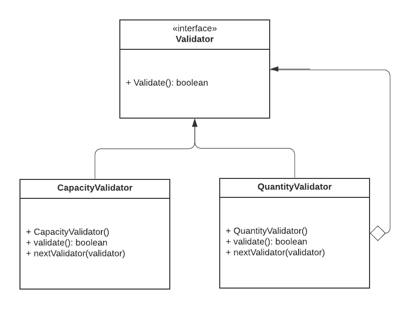
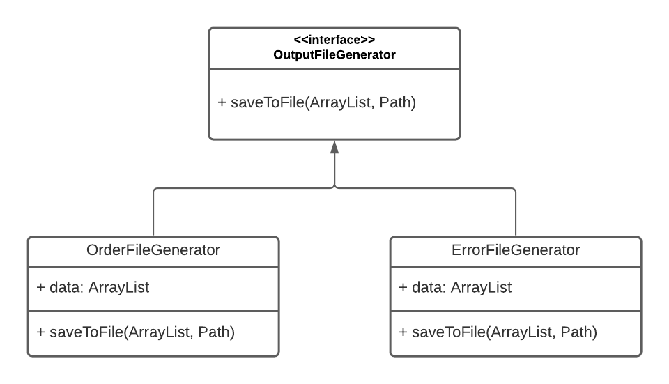
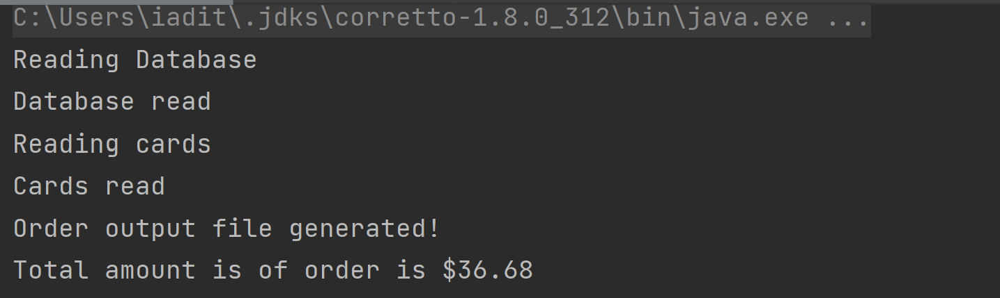
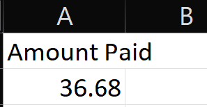
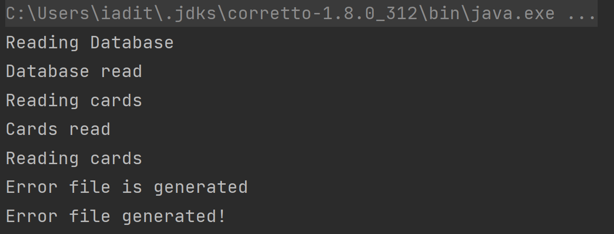
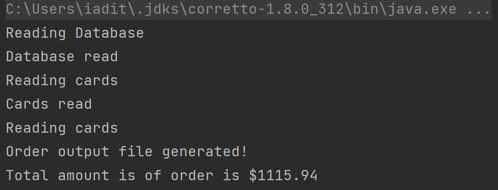
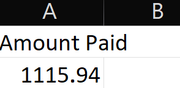

# OrderApplication

Name: Aditya Inampudi 
SJSU ID: 015211027  

## Instructions to run project:
1. Clone the repository or get the zip file from OrderApplication.
2. To run the code, you'll need the Intellij IDE.
3. Using Open Project in Intellij, open the zipped folder or the full folder.
4. After you've opened the project, execute OrderApplication.java, which is located in src folder.
5. Java 8 is required to run the application.
6. After that, set the configuration to java 8 and set the arguments to <dataset_path> <cards_path> <inputfile_path>
7. The output order file or error file will be created in the directory path of inputfile.

## Design Patterns Used in the project

### Chains of Responsilibilty:
 It's a behavioral design pattern that allows you to route requests through a series of handlers. When a request arrived, each handler choose whether to process it or send it on to the next handler in the chain. This design pattern was utilized to assess whether or not the order could be handled appropriately. This pattern is used in the files Validator, CapacityValidator and QuantityValidator. Before determining whether or not the order can be handled, a ValidationHandler object is generated and passed from one Handler to the next using the same.

### Factory Method:
 It's a creational design pattern that provides a user interface for producing things in a superclass while allowing subclasses to change the type of objects generated. This pattern has been used to output when an order has been processed. The OutputFileGeneratore, OrderFileGenerator and ErrorFileGenerator are used as a part of this pattern implementation. The object of OutputFile will be generated when the corresponding concrete handler determines whether the output should be a checkout file or an error file. The FileReader class is used in the program to read and write files.

     
## Screenshots of Test Cases:

### Test Case 1: 

#### Intermediate output:

     
#### Output:

### Test Case 2: 

#### Intermediate output:

     
#### Output:

### Test Case 3: 

#### Intermediate output:

     
#### Output:

